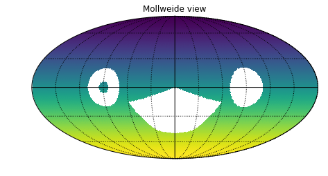

# healpixSelector

A tool designed to assist in the selection of regions of the sky for astronomical studies. Allows users to easily select regions of the sky using the HEALPix pixelization scheme and interactive visualization powered by `d3.js`.

## Features

- Selecting sky regions using the `healpy`

- Interactive visualization of the sky using `d3.js`

- Support for both celestial coordinates (RA/Dec) and Galactic coordinates
Output of selection in both HEALPix pixel indices and sky coordinates (RA/Dec or Galactic)

## Dependency

- healpy
- d3.js

## Usage

Visit jupyter notebook [spatial_selection.ipynb](https://github.com/xiaolng/healpixSelector/blob/master/spatial_selection.ipynb) for demonstration of the selection of 

- polygon
- disc
- ring
- ellipse
- Galactic avoidence region
- Ecliptic region
- irregular shapes

To select the HEALPix ID visit interactive [skymap](https://xiaolng.github.io/healpixSelector/skymap2.html).

Healpixel-based selection of sky areas: convex, concave, and hollow regions can be selected on multiple spatial projections

## Citation

## References
[Preparing to Discover the Unknown with Rubin LSST: Time Domain](https://doi.org/10.3847/1538-4365/ac3bca)

[HEALPix: A Framework for High-Resolution Discretization and Fast Analysis of Data Distributed on the Sphere](https://doi.org/10.1086/427976)

